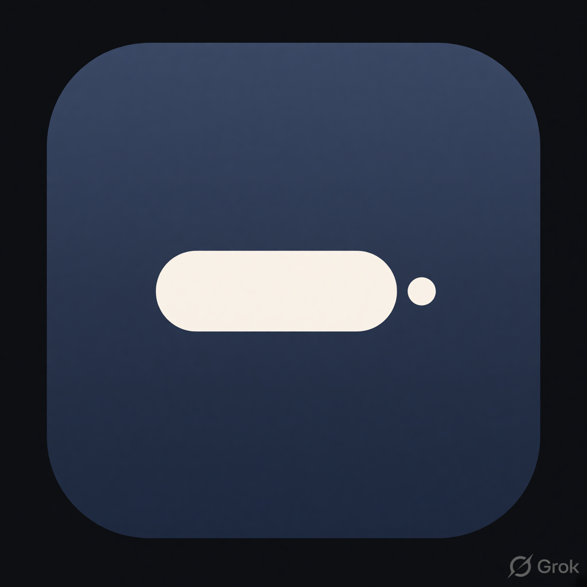

# Anear



The mark is a rounded charcoal bar with a near-dot beside it.

Ambient first-person lines that appear near your cursor on macOS — like flavor
text from a first-person game, but for your desktop. **Work in progress.**

Anear is a menu-bar accessory: it runs Dock-less (no icon in the Dock), sits in
the menu bar, and eventually draws short lines in a small overlay next to the
cursor.

## Requirements

- macOS 14+

## Develop

```sh
swift test     # run the unit tests (placement, timing, lines, config store,
               # shuffle bag, scheduler, pause)
swift build    # build everything
swift format lint --strict --recursive --configuration .swift-format Sources Tests Package.swift  # style lint (CI runs the same command)
```

> **Command Line Tools only (no Xcode):** a local quirk of this setup — the
> CLT-only toolchain doesn't ship XCTest, and SwiftPM can't find Swift Testing
> on its own. It is not a package setting: CI (Xcode) runs plain `swift test`.
> If you hit it, point the compiler at the CLT framework and add the two rpaths
> the CLT framework needs at runtime:
>
> ```sh
> swift test \
>   -Xswiftc -F/Library/Developer/CommandLineTools/Library/Developer/Frameworks \
>   -Xlinker -rpath -Xlinker /Library/Developer/CommandLineTools/Library/Developer/Frameworks \
>   -Xlinker -rpath -Xlinker /Library/Developer/CommandLineTools/Library/Developer/usr/lib
> ```

## Run

```sh
swift run Anear
```

or build a proper .app bundle (menu-bar item, `LSUIElement`, ad-hoc signed):

```sh
./make-app.sh
open build/Anear.app
```

Either way you get a menu-bar icon — the bar with the near-dot, dimmed
while paused — with **Pause**, **Preview**, **Config…**, **Start at
Login**, and **Quit** — no Dock icon. Hover the icon for the **Anear**
(or **Anear · paused**) tooltip. Every 8–20 minutes
of *active* time a scheduler deals the next line from a shuffle bag and
shows the fading pill; it stays silent while you are idle, the screen is
locked or asleep, the screensaver is running, or secure input is active.
**Pause** freezes the cadence until you choose **Resume**, and the paused
state survives relaunch. **Preview** shows the next line from a shuffle bag
over your lines (the eight-line first-person starter pack until you edit
them), as a fading pill pinned near the cursor: it holds for ~4s, fades out
over ~1.25s, never takes focus, and lets clicks pass through to whatever is
under it.

**Config…** opens a small window with three sections: the interval bounds
("Every [min] to [max] minutes"), the current lines one first-person line
per row, and the config file path. **Preview** in the window shows the last
non-empty line of the draft as a fading pill; **Save** parses the lines and
minutes, validates them, persists everything, and closes the window (Save
is explicit — closing the window via the red traffic light never saves).
Lines and the interval live in a real JSON file at
`~/Library/Application Support/Anear/config.json` (pretty-printed, created
on first Save; the window shows its path and can reveal it in Finder).
The pause / start-at-login flags intentionally stay in UserDefaults —
they are runtime state, not config. The interval takes effect immediately
on Save; a fresh countdown rolls from the new range.

**Start at Login** is a checkbox backed by `SMAppService.mainApp`: it is
turned **on by default** after first launch (the one-time registration is
attempted once and never retried) and can be toggled any time afterwards.
The login item only sticks when Anear runs as a proper app bundle —
`build/Anear.app` via `make-app.sh`, or an Anear.app copied to
`/Applications`. A raw `swift run Anear` process is not an app bundle and
cannot register a durable login item; the first-launch auto-enable also
only happens when Anear is launched as `Anear.app`, so `swift run` never
consumes the one-shot flag.

## Status

- [x] SPM package: `AnearCore` library + `Anear` executable
- [x] Cursor-overlay placement math (flips + clamping), unit tested
- [x] Overlay panel + fade (Preview menu item)
- [x] Config store (JSON file) + shuffle bag (starter pack lines, no
      immediate repeat), unit tested
- [x] Presence-gated sparse scheduler (idle/lock/screensaver/sleep/secure
      input aware) + sticky Pause, unit tested with a fake clock
- [x] Config window (lines + interval bounds, JSON file path, Save closes
      the window) + Start at Login (SMAppService, on by default after first
      launch)

## License

MIT
